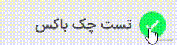

# jb-checkbox-react

simple RTL checkbox for react and Mobx user can click to make some variabl true or false

## installation

run `npm install jb-checkbox-react` to install package with npm  

## usage

import component in your page `import JBCheckBox from 'jb-checkbox-react'`  
you can import special edition for different envirement like es6 or requirejs or systemjs like:  
`import JBCheckBox from 'jb-checkbox-react/dist/JBCheckBox.cjs.min'` for requirejs version  
`import JBCheckBox from 'jb-checkbox-react/dist/JBCheckBox.min'` for standard es6  
`import JBCheckBox from 'jb-checkbox-react/dist/JBCheckBox.systemjs.min'` for systemjs  

use in react render like every other component  
`<JBCheckBox title="test title" value={this.checkbox1} onChange={(e)=>this.onChange(e ,'checkbox1')}></JBCheckBox>`  
demo image:  

